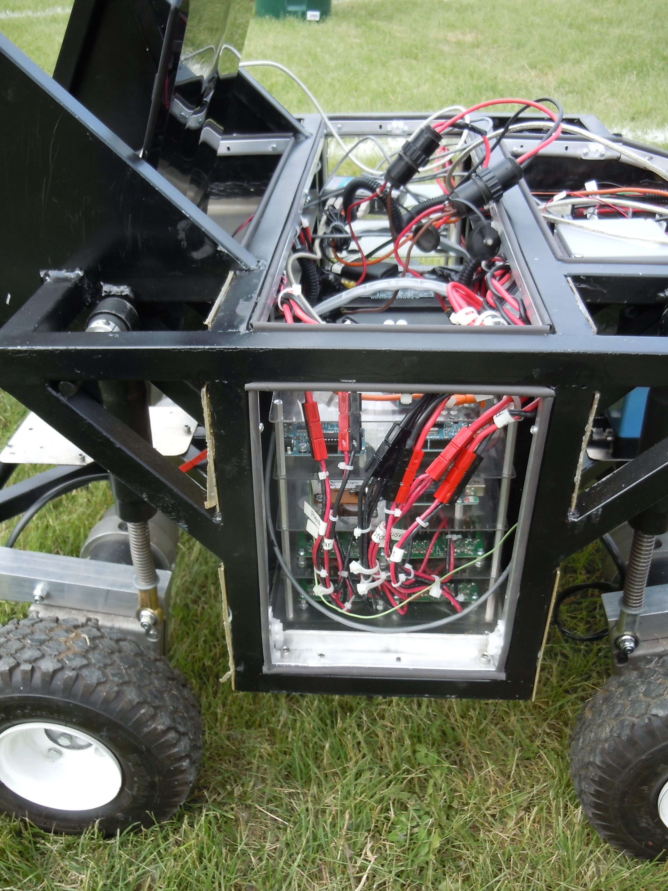
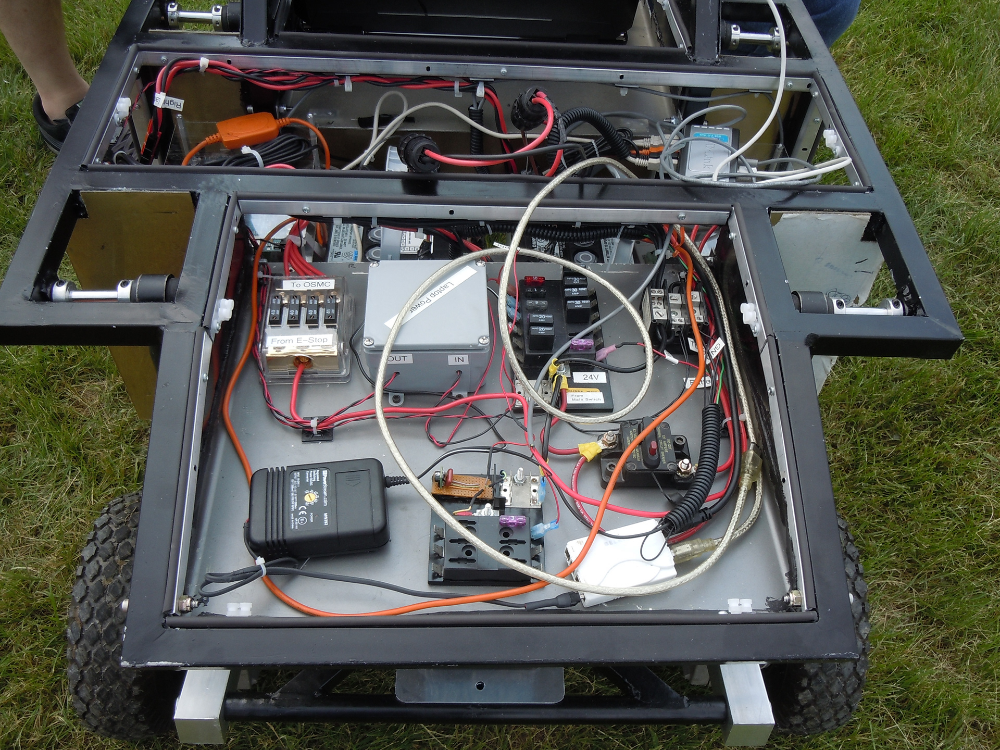
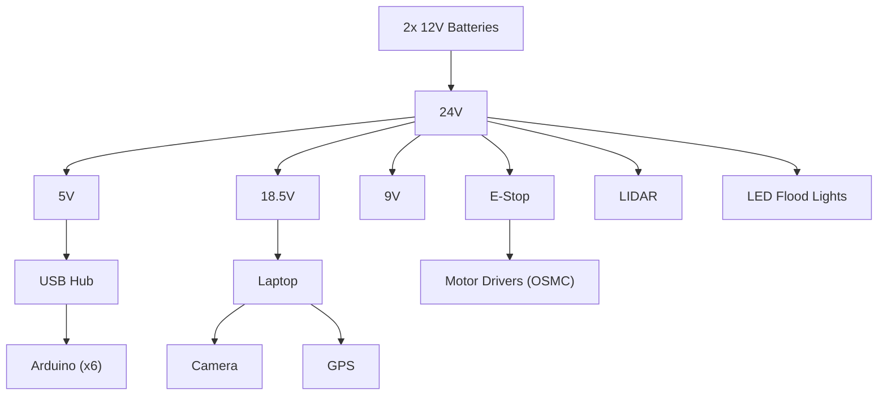

# IGVC Robot
This platform was developed for the 2011 Intelligent Ground Vehicle Competition (IGVC). In short IGVC is a lower cost version of the DARPA Grand Challenge that is targeted towards university undergrad teams. The 2011 platform drew many elements from the prior year’s system whose frame design, layout, and systems integration I was involved with. These are less than golf cart sized platforms that would drive on an outdoors obstacle course composed of painted lanes, barrels, grass, trashcans, ramps, fences, etc.

| Robot Rendering | Robot with Callouts |
| --- | --- |
|  |  |

For 2011 I took a more overall advisory role and focused on electrical system support / integration. Papers from a few of the years can be found in the papers folder. These papers go into some of the software and hardware on the robots more indepth than this write up. When reading these keep in mind that this was before the Robot Operating System (ROS), the prevelance of many development boards common today for a host of sensors, and the wide adoption of smart phones with cameras. Things were def a bit hacked and buggy. Our best run ever (which earned us 3rd place) was done with an intermittent wheel that we could not trace down. The SICK Nav 200 units mentioned in the papers were found by a member on eBay the seller wanted to move a lot of the 10 units. The member sent in an offer at $500.00 and the seller accepted the team got 2 SICKs and 8 members got a Nav 200 for $60+. Another member worked and sort of reverse engineered the protocol, came up with a board, and the NAV 200 units could work over USB. Integrating the LIDAR units into the navigation never quite worked well and so the most successful runs were always with that data being ignored. 

## System Layout
| Zone Rendering | Side View of Robot |
| --- | --- |
|  |  |

The robot was split into 3 main zones with specific functions for each. A front, middle, and rear zone. The front zone held power distribution and conversion from 24V to various power rails that the robot needed. The middle zone held batteries, USB micro controller boards, and other data acquisition. The batteries were placed in the center and on the left and right were stacks which could be pulled out and worked on. The harnesses running to the stacks had enough slack to give some flexibility and access to each board. The rear was where the laptop was placed which controlled and drove the robot. The image below shows this at the competition.

## Power System

Several entrants would power systems off of generators and with AC to DC converts. The electrical system was an all DC approach using conventional 12V marine deep cycle batteries which were charged with standard 12V battery chargers. Everything was powered off of the batteries including the laptop removing the need to use the AC adapter. In all there was a 24V, 5V, 9V, and an 18.5V (laptop) rail. The motors were connected to the emergency stop system so that only motor power could be killed. This allowed for testing and sensor monitoring with a fully powered system that had hardware disabled motors. This greatly enhanced testing compared to the previous approach of e-stopping the entire system. The robot could be push tested while monitoring sensor data and algorithm decisions real time before running the platform. This with wheels up testing on cinder blocks presented multiple steps of unit testing which allowed for edge case exploration. The system also had headlights. This allowed for system testing at night while the competition did not to runs during the night the event was open 24hrs continuously from the first day to the last and we were not the only team which would test on the practice area at night (more than a few times the robot was running at 2am and we weren't the only ones).

#### Diagram of Power Distribution

## Weather Robustness
A bit of effort was made to improve the weather performance over the years. The competition would only stop running attempts on the course for lightning and many teams could not run in the rain. By running in the rain, we could get more attempts at the course while other teams gave up their slots, we could also do more field testing on the test track, and the vision system which would always have challenges with shadows performed better with the diffuse lighting that the cloud cover provided. The body panels were sealed to the frame with a gasket, drip loops and custom fabricated glands were used where sensor cables needed to pass through to the outside. These pass throughs were located under the front and rear overhangs. The more runs we could get the more bugs we could fit. Teams were ranked but distance of their longest run and then tie broken by speed. We would approach most runs as welp lets try this new thing. Our 3rd place run in 2011 year was done with a faulty and intemittent rear wheel and that was our last slot of the entire event. 

## Rankings & Video
From 2008 to 2012 the IGVC team consistently in the top 10 with 1x 3rd place, and 2x 5th place finishes. Video of the 3rd place run in 2011. 
